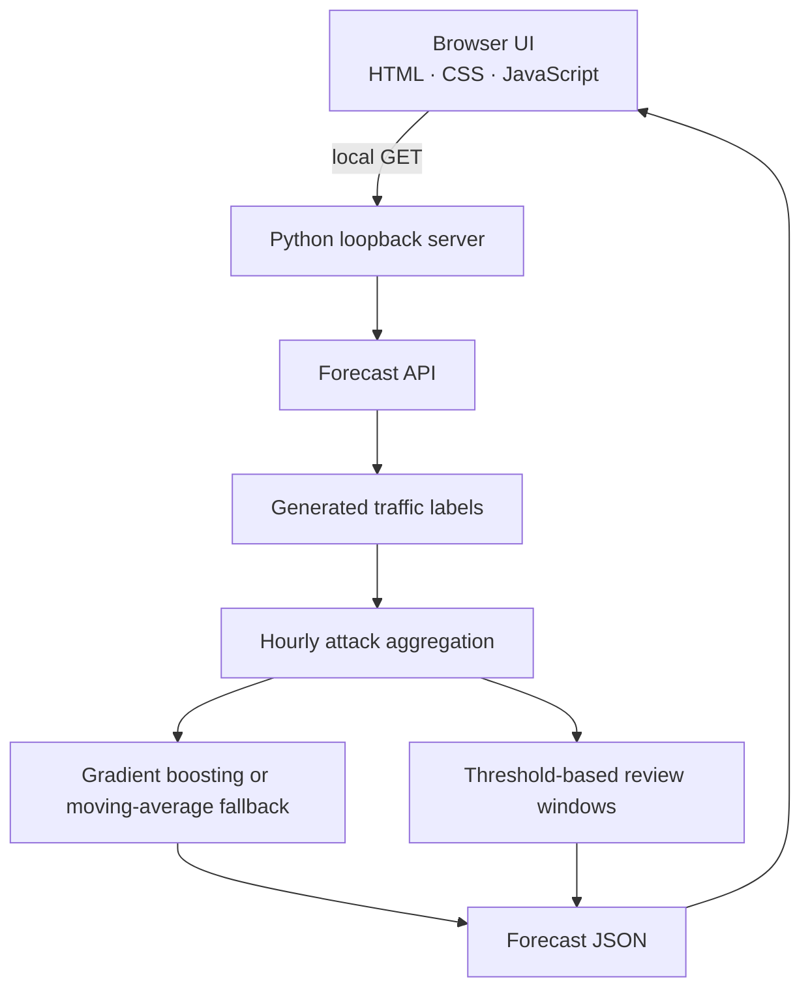

  

<h1 align="center">VectorCast</h1>

  <strong>Network attack forecasting and signal triage</strong> 
  A local-first console for exploring synthetic attack volume, near-term projections, and unusual traffic windows.

  
  
  
  
  

---

## What is VectorCast?

VectorCast demonstrates a defensive forecasting workflow: generated flow labels are aggregated into hourly attack counts, a model projects the next set of intervals, and unusual observed hours are marked for review. The browser UI uses plain HTML, CSS, and JavaScript; Python serves the assets and forecast data from the loopback interface.

The default workspace uses a reproducible synthetic dataset. It does not ingest production telemetry, attribute attacks to real actors, or replace SIEM/NDR detection.

## Quick start

Requirements: Python 3.11 or newer.

    git clone https://github.com/k-vandith/network-attack-forecasting.git
    cd network-attack-forecasting
    python -m venv .venv

Activate the environment:

    # Windows PowerShell
    .venv\Scripts\Activate.ps1

    # Linux / macOS
    source .venv/bin/activate

Install and launch:

    python -m pip install --upgrade pip
    python -m pip install -r requirements.txt
    python run.py

Open **http://127.0.0.1:8501**. The server binds to loopback by default.

## Try it in five steps

1. **Launch the console.** Run `python run.py` and open the local address above.
2. **Set the sample size.** Choose between 400 and 4,000 generated traffic records.
3. **Choose a lookahead.** Select a projection horizon of 6, 12, 18, or 24 hours.
4. **Inspect the signal.** Compare observed history with the dashed projection, then review category mix and flagged windows.
5. **Export your analysis.** Download the time series as CSV or the complete demo payload as JSON.

## Inputs and outputs

| Area | Current behavior |
|---|---|
| Data source | Reproducible synthetic network labels; no live capture |
| Sample size | 400–4,000 records, in steps of 200 |
| Forecast horizon | 6, 12, 18, or 24 hourly intervals |
| Forecast engine | Scikit-learn gradient boosting when available; moving-average fallback otherwise |
| Forecast output | Observed history, predicted attack counts, mean metrics, and relative outlook |
| Review signals | Recent observed hours above the full-series mean plus two standard deviations |
| Export | CSV time series and JSON report |
| Network behavior | Local HTTP assets and API; no telemetry upload or external data lookup |

## Architecture

## Reading the results

- **Forecast outlook** compares the average projected count with the average of the latest observed hourly bins. The label is `Watch` at 4% above baseline and `Elevated` at 12% above baseline; otherwise it is `Stable`. These are explanatory UI bands, not calibrated severity scores.
- **Hourly attack volume** displays the observed series as a solid line and model output as a dashed line. The projection is an estimate, not a guarantee.
- **Attack categories** counts the generated `dos`, `probe`, `r2l`, and `u2r` labels across the selected sample.
- **Risk windows** marks recent observed intervals above the series-wide mean plus two standard deviations. A flagged interval is a review cue, not proof of malicious activity.
- **Model engine** identifies the active forecasting backend.

## API and development

The forecasting functions remain available for Python callers:

    from src.forecasting import (
        attack_volume_series,
        forecast_volumes,
        load_cicids_style,
    )

    traffic = load_cicids_style(n=1200)
    hourly = attack_volume_series(traffic)
    result = forecast_volumes(hourly, horizon=12)

The local service also exposes `GET /api/health` and `GET /api/forecast?n=1200&horizon=12`. Supported API settings are validated server-side.

Run the checks:

    python -m pip install -r requirements-dev.txt
    pytest -q
    ruff check src/app.py src/ui_theme.py src/webapp.py run.py tests/test_ui_smoke.py tests/test_webapp.py
    bandit -q -r src/app.py src/webapp.py run.py -ll
    pip-audit -r requirements.txt --progress-spinner off

## Privacy, security, and limitations

- The server binds to `127.0.0.1` by default and does not expose the dashboard on all network interfaces.
- Assets and forecast requests are served locally; there are no remote fonts, chart CDNs, tracking calls, or external threat-intelligence lookups.
- Response headers include a restrictive Content Security Policy, `X-Content-Type-Options`, `X-Frame-Options`, and a no-referrer policy.
- The default UI uses synthetic telemetry only. Do not interpret its outputs as findings from a real network.
- Synthetic labels may not represent real traffic distributions. Forecast quality is not a substitute for validation against held-out, representative data.
- Threshold flags and outlook bands are intentionally transparent heuristics and do not establish attribution, intent, or causality.

## Project map

    network-attack-forecasting/
    ├── README.md
    ├── run.py
    ├── src/
    │   ├── app.py             # compatibility entrypoint
    │   ├── webapp.py          # local HTTP server and JSON API
    │   ├── forecasting.py     # hourly aggregation and time-series forecast
    │   ├── pipeline.py        # synthetic features and classifier helpers
    │   └── ui_theme.py        # retained theme helper
    ├── web/
    │   ├── index.html
    │   ├── styles.css
    │   ├── app.js
    │   └── mark.svg
    ├── tests/
    │   ├── test_pipeline.py
    │   ├── test_forecast.py
    │   ├── test_ui_smoke.py
    │   └── test_webapp.py
    ├── scripts/
    └── .github/workflows/tests.yml

## License

MIT
